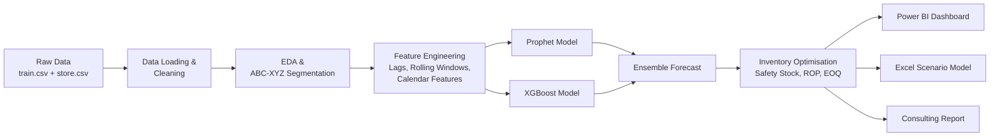
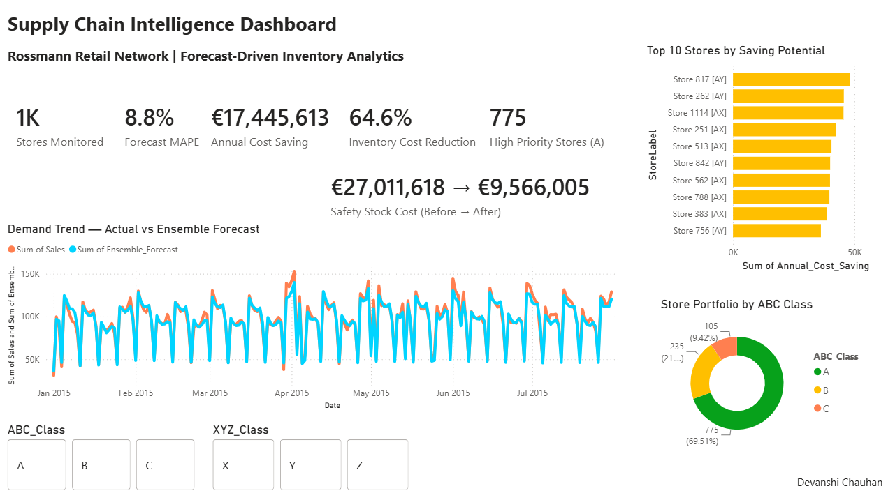
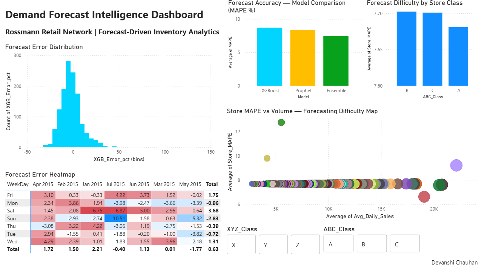
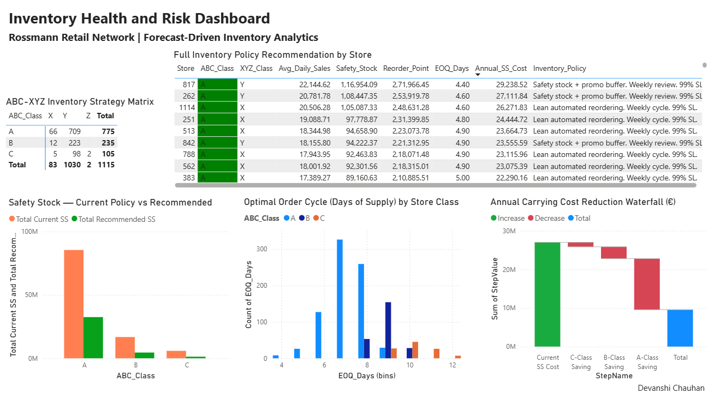
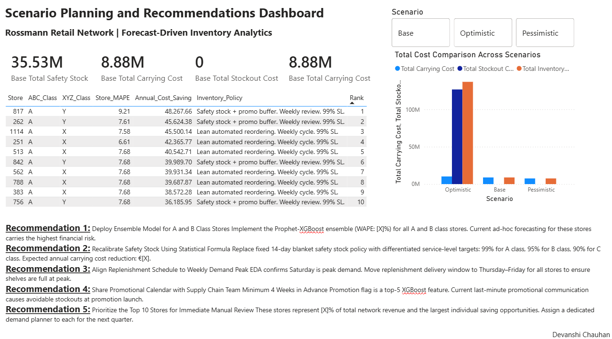

# Demand Forecasting & Supply Chain Optimisation

> Forecast-driven inventory analytics reducing safety stock carrying cost by
> 64.6% (€17.4M annually) across a 1,115-store retail network using
> Prophet, XGBoost, and ensemble modelling.

## Business Problem
Retail networks often rely on a single, undifferentiated inventory policy applied uniformly across hundreds of stores — holding the same days of 
safety stock regardless of a location's revenue contribution or demand volatility. This either ties up excess working capital in stable, 
low-priority stores or leaves high-value, unpredictable stores under-protected against stockouts. This project replaces that one-size-fits-all 
approach with a forecast-driven, segment-specific inventory strategy across a 1,115-store network, using machine learning demand forecasts to size 
safety stock precisely to each store's actual risk profile.

## Key Results
- 64.6% reduction in annual safety stock carrying cost (€27.0M → €9.6M)
- 8.8% network-wide forecast MAPE using ensemble model
- ABC-XYZ segmentation across 1,115 stores driving differentiated policy

## Tech Stack
`Python` `Prophet` `XGBoost` `pandas` `Power BI` `Excel` `DAX`

## Architecture




## Repository Structure

```
dfsc/
├── assets/
│   └── screenshots/              # Power BI dashboard page exports
├── data/                          # Not tracked in Git — see Setup
│   ├── raw/                       # train.csv, store.csv (download separately)
│   ├── processed/                 # Generated by running notebooks 01-02
│   └── external/
├── excel/
│   └── scenario_analysis.xlsx     # 5-sheet scenario planning workbook
├── notebooks/
│   ├── 01_eda_business_insights.ipynb
│   ├── 02_preprocessing_feature_engineering.ipynb
│   ├── 03_prophet_forecasting.ipynb
│   ├── 04_xgboost_forecasting.ipynb
│   ├── 05_model_comparison.ipynb
│   └── 06_inventory_optimisation.ipynb
├── outputs/
│   ├── forecasts/
│   │   └── xgboost_forecasts.csv
│   └── powerbi/
│       ├── dfsc.pbix               # Power BI report file
│       ├── pb_abc_xyz_matrix.csv
│       ├── pb_forecast_actuals.csv
│       ├── pb_forecast_comparison.csv
│       ├── pb_inventory_policy.csv
│       ├── pb_kpi_summary.csv
│       ├── pb_model_metrics.csv
│       ├── pb_scenario_analysis.csv
│       ├── pb_top10_opportunities.csv
│       ├── pb_waterfall_steps.xlsx
│       └── pb_xgb_forecast.csv
├── reports/
│   └── consulting_report.md       # Full consulting-style deliverable
├── src/
│   ├── __init__.py
│   ├── build_excel_workbook.py
│   ├── build_waterfall_excel.py
│   ├── config.py
│   ├── constants.py
│   ├── data_loader.py
│   ├── evaluation.py
│   ├── feature_engineering.py
│   ├── inventory/
│   │   ├── __init__.py
│   │   └── optimisation.py
│   └── models/
│       ├── __init__.py
│       ├── prophet_model.py
│       └── xgboost_model.py
├── .gitignore
├── pyproject.toml
├── README.md
└── requirements.txt
```

## Setup
## Setup

\`\`\`bash
git clone https://github.com/devanshiddc2608/Demand-Forecasting-and-Supply-Chain-Optimisation.git
cd Demand-Forecasting-and-Supply-Chain-Optimisation

# Install the project as an editable package
pip install -e .

# Install all dependencies
pip install -r requirements.txt
\`\`\`

**Before running the notebooks**, download `train.csv` and `store.csv` from 
the [Rossmann Store Sales dataset](https://www.kaggle.com/c/rossmann-store-sales/data) 
and place them in `data/raw/`. Then run notebooks `01` through `06` in order 
— each one regenerates the processed data and outputs needed by the next.

## Dashboard

### Page 1 — Executive Supply Chain Overview


### Page 2 — Demand Forecast Intelligence


### Page 3 — Inventory Health and Risk


### Page 4 — Scenario Planning and Recommendations


## Author
Devanshi Chauhan | [LinkedIn] | [Portfolio]
